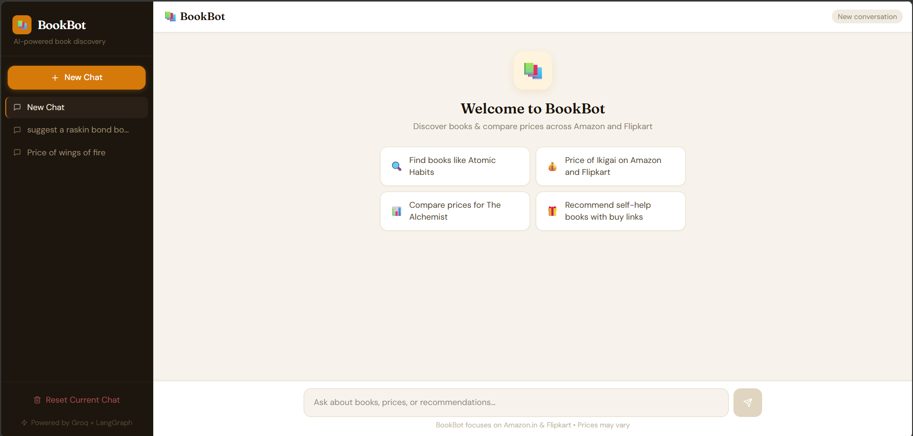
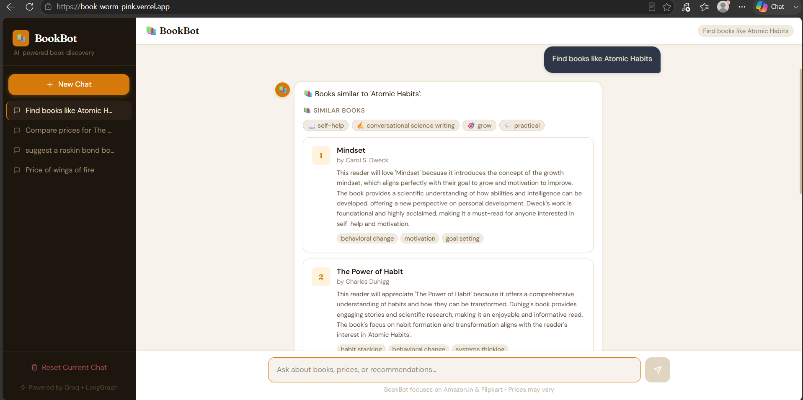
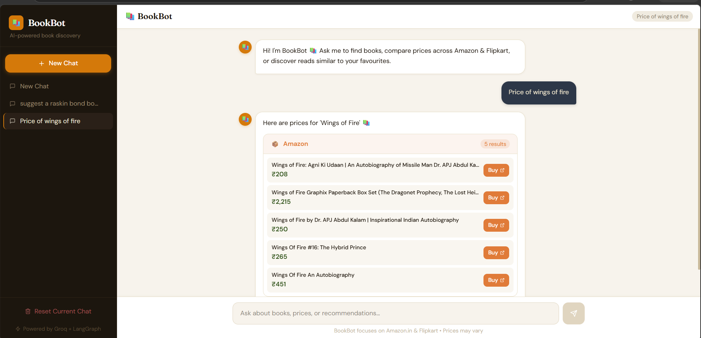

#  Book-Worm

An AI-powered book recommendation app that suggests books and compares their prices across Indian e-commerce sites like Amazon and Flipkart.

 **Live App**: [book-worm-pink.vercel.app](https://book-worm-pink.vercel.app/)

## What it does

- Recommends books similar to ones you like, using a multi-agent LLM pipeline
- Fetches live prices from Amazon.in and Flipkart
- Highlights the best deal between stores

## Tech Stack

- **Frontend**: React + Vite + Tailwind CSS
- **Backend**: Python (Flask) + LangChain
- **AI**: Groq LLM
- **Data**: SerpAPI + Playwright (for price scraping)
- **Cache**: Redis (optional)

## Getting Started (Windows)

### 1. Clone the repo

```bat
git clone https://github.com/diyabhattacharjee-git/Book-Worm.git
cd Book-Worm
```

### 2. Backend

```bat
cd backend
python -m venv venv
venv\Scripts\activate
pip install -r requirements.txt
playwright install chromium
copy .env.example .env
```

Add your keys to `.env`:

```env
GROQ_API_KEY=your_groq_key
SERP_API_KEY=your_serpapi_key
```

Run it:

```bat
python app.py
```

Backend runs at `http://localhost:5000`.

### 3. Frontend

Open a new terminal:

```bat
cd Book-Worm\frontend
npm install
copy .env.example .env.local
npm run dev
```

Frontend runs at `http://localhost:3000` and talks to the backend automatically.

##  Screenshots

### Home Page


### Book Recommendation


### Price Price



## Notes

- Built and tested on **Windows**. Gunicorn (used for production) doesn't run natively on Windows — use Docker or WSL if you need to test that.
- If `venv\Scripts\activate` fails in PowerShell, run once: `Set-ExecutionPolicy -Scope CurrentUser -ExecutionPolicy RemoteSigned`

